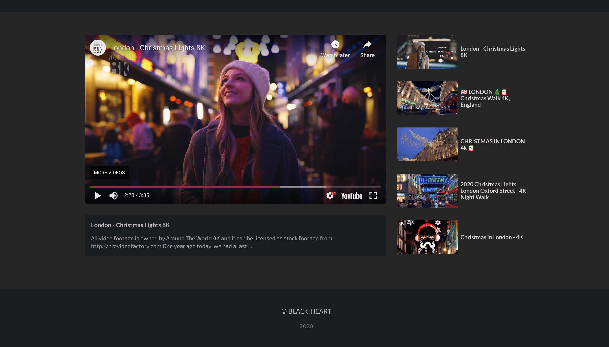

# Video-Z

**Note**: in beta  

## Description

- A simple video search and play platform.
- Built using `Typescript` and `ReactJs`

## Getting started

- `git clone https://github.com/The-sad-philosopher/VideoZ.git`  
- `npm install` or `yarn`  
- Create a `.env` file and paste your  `API Key`  in the format shown below

  ```javascript
    REACT_APP_YOUTUBE_API_KEY=<your_api_key>
  ```

- `npm start` or `yarn start`

## Screenshots  


taken in chromium browser


